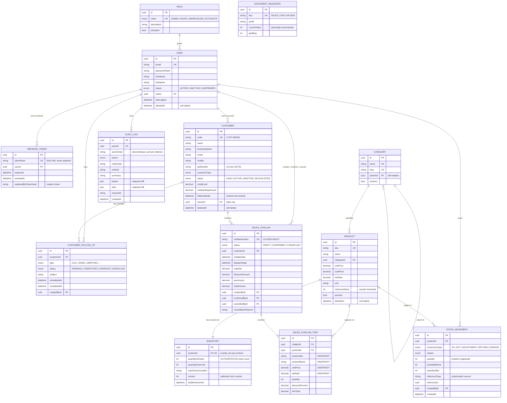

# Database design

- [ER diagram](#er-diagram)
- [Design decisions](#design-decisions)
- [Entity reference](#entity-reference)
- [Referential actions](#referential-actions)
- [Indexes](#indexes)
- [Constraints Prisma cannot express](#constraints-prisma-cannot-express)

---

## ER diagram



---

## Design decisions

### 1. Inventory is the single source of truth for stock

The brief listed "Current Stock" as a product field. It is deliberately **not**
a column on `products`.

A writable quantity on both `products` and `inventory` is the single most common
cause of drift in small ERP systems: two code paths update two columns, one
forgets, and the catalogue and the warehouse disagree forever. `Product` owns
catalogue policy (price, tax, `minimumStock`); `Inventory` owns the physical
count. Reads join the two; there is exactly one writable copy of the number.

### 2. Snapshot on commit

`SalesChallanItem` copies `productSku`, `productName`, `unitPrice`, `taxRate`
and `unit` at the moment the line is written, and never refreshes them.

Without this, raising a product's price rewrites the totals on every historical
document that contains it. A challan is a statement about what was dispatched at
what price on a given day — that statement must not change because someone
edited the catalogue six months later.

### 3. Append-only stock ledger

`StockMovement` rows are never updated or deleted. A correction is a
*compensating entry*, not an edit. Every row records `quantityBefore` and
`quantityAfter`, so the ledger reconciles to the balance at any point in time and
a discrepancy can be traced to a specific transaction.

### 4. Soft delete where history depends on it

`User`, `Customer` and `Product` carry `deletedAt`. Hard-deleting them would
either orphan financial history or cascade it away. Business keys are
*tombstoned* on delete (`user@x.com` → `user@x.com.deleted.1738…`), which frees
the unique index so the value can be reused without resurrecting the old row.

`Category` and draft `SalesChallan` are hard-deleted: neither can be removed
while anything references it, so a deleted one is by definition unreferenced.

### 5. Money is DECIMAL, never FLOAT

Every monetary column is `DECIMAL(14,2)`. All arithmetic is performed in integer
paise and converted once at the boundary (`utils/money.ts`). `0.1 + 0.2 !== 0.3`
becomes a one-paisa mismatch on an invoice, which becomes an accounting dispute.

### 6. Gap-free document numbers via a sequence table

`DocumentSequence` is incremented with a single
`INSERT … ON CONFLICT DO UPDATE … RETURNING` inside the caller's transaction.
Postgres holds a row lock for the transaction's lifetime, so concurrent challans
serialise on that row and each receives a distinct number.

The naive `SELECT MAX(number) + 1` is a race: two requests read the same maximum
and both try to use it.

---

## Entity reference

| Table | Rows describe | Lifecycle |
|---|---|---|
| `roles` | The four system roles | Seeded, never created at runtime |
| `users` | Staff accounts | Soft delete, email tombstoned |
| `refresh_tokens` | Active sessions | Rotated on use; pruned every 6h |
| `customers` | Accounts and their commercial terms | Soft delete, mobile tombstoned |
| `customer_follow_ups` | CRM activities | Cascade-deleted with the customer |
| `categories` | Two-level catalogue tree | Hard delete, blocked while in use |
| `products` | Catalogue entries | Soft delete, SKU tombstoned |
| `inventory` | Physical stock, one row per product | Cascade-deleted with the product |
| `stock_movements` | Immutable stock ledger | Append-only, never deleted |
| `sales_challans` | Delivery documents | DRAFT hard-deletable; otherwise cancelled |
| `sales_challan_items` | Line items with price snapshots | Cascade-deleted with a draft |
| `document_sequences` | Atomic counters | Upserted |
| `audit_logs` | Compliance trail | Append-only |

---

## Referential actions

Every relation declares its action explicitly; nothing is left to a default.

| Relation | Action | Why |
|---|---|---|
| `users.roleId → roles` | `RESTRICT` | A role with members must not be removable |
| `refresh_tokens.userId → users` | `CASCADE` | A session has no meaning without its user |
| `customers.ownerId → users` | `SET NULL` | Deactivating a rep must not delete their accounts |
| `customer_follow_ups.customerId → customers` | `CASCADE` | Activities belong to their customer |
| `customer_follow_ups.createdById → users` | `RESTRICT` | Preserves "who logged this" on the timeline |
| `products.categoryId → categories` | `RESTRICT` | Deleting a category with products is data loss |
| `inventory.productId → products` | `CASCADE` | Stock record is part of the product |
| `stock_movements.productId → products` | `RESTRICT` | Ledger must survive catalogue cleanup |
| `sales_challans.customerId → customers` | `RESTRICT` | A customer with challans is not hard-deletable |
| `sales_challan_items.challanId → challans` | `CASCADE` | Deleting a draft removes its lines |
| `sales_challan_items.productId → products` | `RESTRICT` | The product must stay resolvable for reporting |
| `audit_logs.actorId → users` | `SET NULL` | The trail outlives the actor (email is denormalised) |

---

## Indexes

Chosen from the actual `where` clauses in the repositories, not added
speculatively — every index costs write throughput.

**Single-column** — foreign keys, status enums, soft-delete flags, and the
columns each list endpoint sorts by (`createdAt`, `challanDate`, `name`,
`followUpDate`, `outstandingAmount`).

**Composite / partial** (in the integrity migration):

| Index | Serves |
|---|---|
| `sales_challans (status, challanDate DESC)` | The default challan list view |
| `customers (ownerId, status) WHERE deletedAt IS NULL` | A rep's "my accounts by stage" |
| `products (categoryId, isActive) WHERE deletedAt IS NULL` | Browse-by-category |
| `stock_movements (productId, movementType, createdAt DESC)` | Per-product ledger history |
| `customer_follow_ups (customerId, scheduledAt DESC)` | The customer timeline |

---

## Constraints Prisma cannot express

Prisma's schema language has no syntax for CHECK constraints or partial unique
indexes, so `20260729000100_integrity_constraints/migration.sql` adds them by
hand.

**Why bother when the service layer already validates all of this?** Because the
service layer is one process among several that will eventually touch this
database: a migration script, a data fix run from psql at 2am, a future
reporting job, or a regression in our own code. Application validation prevents
mistakes; database constraints make a class of corrupt states *unrepresentable*.

```sql
-- The single most important invariant in the system.
ALTER TABLE "inventory"
  ADD CONSTRAINT "inventory_quantity_on_hand_non_negative"
  CHECK ("quantityOnHand" >= 0);

-- Reserved stock is a subset of stock on hand.
ALTER TABLE "inventory"
  ADD CONSTRAINT "inventory_reserved_not_exceeding_on_hand"
  CHECK ("quantityReserved" <= "quantityOnHand");

-- The state machine's data requirements, enforced in SQL: a half-applied
-- transition cannot survive a commit.
ALTER TABLE "sales_challans"
  ADD CONSTRAINT "sales_challans_confirmed_metadata"
  CHECK ("status" <> 'CONFIRMED' OR
         ("confirmedAt" IS NOT NULL AND "confirmedById" IS NOT NULL));

-- "Unique among LIVE rows" — a plain UNIQUE index would be wrong, because a
-- soft-deleted customer must release their mobile number for reuse.
CREATE UNIQUE INDEX "customers_mobile_live_key"
  ON "customers" ("mobile")
  WHERE "deletedAt" IS NULL;
```

Also constrained: non-negative prices and amounts, tax rates within 0–100,
positive line quantities, discounts within 0–100, and cancellation metadata on
cancelled challans.
